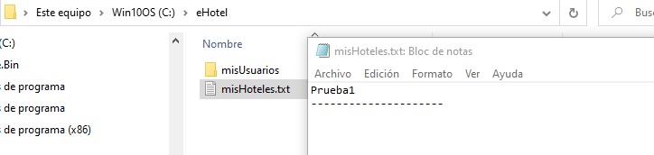

# Practicas-Programacion-Avanzada

## Contenido añadido:

- Se han añadido dos nuevos metodos en la inferfaz:
1. Vector<String> guardarInfoDatostxt(String path); Este metodo nos permite guardar en un vector todos los datos de un fichero de texto. Con esto podemos añadir contenido a ficheros ya creados.
2. boolean borrarFicheros(File directorio); Este metodo es un algoritmo recursivo que nos permite borrar todos los ficheros del programa.
  
- Se ha añadido una nueva clase Administrador. Con esta clase podemos borrar todos los ficheros del programa. Para ello se necesita una clave que el administrador debe añadir, no es la misma contraseña que la del usuario admin. La contraseña va encriptada con la clase RSA. Además 

- Se ha añadido una nueva clase RSA. Esta clase nos permite hacer varias cosas relacionadas con la encriptación de los datos.

## ¿Por qué utilizar interfaces?:

  Se ha decido meter estos algoritmos en una interfaz para que puedan usarse más adelante en el caso de que los necesitemos para otras clases. Gracias a esto podemos ahorrar tiempo y coste.
  Por otro lado, más adelante nos será más fácil mejorar el código de formas más eficientes y manteniendo las clases lo más limpias posibles.
  
  La idea principal es ir aplicando estas interfaces al resto del código para ir mejorando la aplicación.
  
## ¡Estamos trabajando en ello!:

En esto es en lo que se está trabajando y estará en futuras versiones

- Meter un método de confirmación de los datos del usuario al crear una sesión. Con este metodo el usuario podrá cambiar los datos en el caso de que se equivoque al crear una cuenta.
- Crear un método que te permita cancelar una reserva.
- Crear un método que te permita borrar un usuario.
- Crear un método que te calcule el precio total de la reserva según los dias que te quedes en el hotel.

## Testeo
### Hotelero
#### Creacion de cuenta
Creacion de una nueva cuenta con licencia de Hotelero:

Cuando una nueva cuenta se crea y la carpeta no existe, el programa la crea automaticamente, esto solo ocurre la primera vez:

El fichero llamado misHoteles.txt guarda los nombres de todos los hoteles, en este caso al no añadir ningun hotel esta vacio.
En el directorio misUsuarios se guardan directorios correspondientes con cada usuario:

El directorio se crea y se le nombra con el nombre y el apellido del usuario. Con apellidos compuestos que van separados por espacios también funciona, lo veremos más tarde.
Dentro de esta carpeta se crean dos ficheros:

El directorio de hotelesUsuario tiene como fin guardar la información de cada uno de los hoteles que tiene este usuario dados de alta en el programa.
En el fichero de texto datos.txt se guardan los datos del usuario:

El formato es el siguiente:
 1. Nombre
 2. Primer apellido
 3. DNI
 4. Contraseña
 5. Licencia
 
 #### Inicio de sesión Hotelero
 Una vez creada la cuenta, como se ve en la primera imagen, te lleva directamente al menu de los hoteleros. Esto también ocurre cuando inicias sesion. 
 Vamos a iniciar sesion con la cuenta que hemos creado antes:
 
 

Como se ve, cuando se inicia sesión y los datos son correctos te lleva al menú hotelero.
A continuación veremos que ocurre si al iniciar sesión alguno de los datos es incorrecto:

En el caso de que el nombre sea incorrecto:

En el caso de que el apellido sea incorrecto:

En el caso de que la contraseña sea incorrecta:

#### Dar de alta un hotel:
Una vez tenemos nuestra cuenta creada, y si tenemos licencia de hotelero, podemos añadir hoteles a la plataforma.
Primero vamos a ver si efectivamente el cliente no tiene hoteles usando la opción de mirar todos los hoteles que tiene el usuario:

Efectivamente no tiene hoteles, así que vamos a añadir uno:

En esta imagen se muestra todo el proceso, primero busca si tiene hoteles, al ver que no tiene crea uno y mete toda la información del hotel. Una vez acabado este proceso se le pregunta si quiere cambiar algo, ahora iremos a ello, pero en este caso no quiere cambiar nada, por lo que lo crea y luego mira si efectivamente ahora tiene un hotel.

Ahora veamos que ha ocurrido en la carpeta:

Dentro de la carpeta eHotel, en el fichero de misHoteles.txt:

Dentro de la carpeta del usuario:

