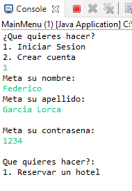

# Practicas-Programacion-Avanzada 
## Contenido añadido: 

- Se han añadido dos nuevos métodos en la interfaz: 

1. Vector<String> guardarInfoDatostxt(String path); Este método nos permite guardar en un vector todos los datos de un fichero de texto. Con esto podemos añadir contenido a ficheros ya creados. 

2. boolean borrarFicheros(File directorio); Este método es un algoritmo recursivo que nos permite borrar todos los ficheros del programa. 

- Se ha añadido una nueva clase Administrador. Con esta clase podemos borrar todos los ficheros del programa. Para ello se necesita una clave que el administrador debe añadir, no es la misma contraseña que la del usuario admin. La contraseña va encriptada con la clase RSA. Además  
  
- Se ha añadido una nueva clase RSA. Esta clase nos permite hacer varias cosas relacionadas con la encriptación de los datos. 

- Se ha añadido una nueva clase Templates donde se irán metiendo los metodos templatizados.

## ¿Por qué utilizar interfaces?: 

Se ha decido meter estos algoritmos en una interfaz para que puedan usarse más adelante en el caso de que los necesitemos para otras clases. Gracias a esto podemos ahorrar tiempo y coste. 
Por otro lado, más adelante nos será más fácil mejorar el código de formas más eficientes y manteniendo las clases lo más limpias posibles. 
La idea principal es ir aplicando estas interfaces al resto del código para ir mejorando la aplicación. 

## Testeo 
### Hotelero 
#### Creación de cuenta 

Creación de una nueva cuenta con licencia de Hotelero: 
 
 

Cuando una nueva cuenta se crea y la carpeta no existe, el programa la crea automáticamente, esto solo ocurre la primera vez: 

 

El fichero llamado misHoteles.txt guarda los nombres de todos los hoteles, en este caso al no añadir ningún hotel está vacío. 

En el directorio misUsuarios se guardan directorios correspondientes con cada usuario: 

 

El directorio se crea y se le nombra con el nombre y el apellido del usuario. Con apellidos compuestos que van separados por espacios también funciona, lo veremos más tarde. 
Dentro de esta carpeta se crean dos ficheros: 

 

El directorio de hotelesUsuario tiene como fin guardar la información de cada uno de los hoteles que tiene este usuario dados de alta en el programa. 
En el fichero de texto datos.txt se guardan los datos del usuario: 

 

El formato es el siguiente: 
 1. Nombre 
 2. Primer apellido 
 3. DNI 
 4. Contraseña 
 5. Licencia 
 
#### Inicio de sesión Hotelero 
Una vez creada la cuenta, como se ve en la primera imagen, te lleva directamente al menú de los hoteleros. Esto también ocurre cuando inicias sesión.  
Vamos a iniciar sesión con la cuenta que hemos creado antes: 

 

Como se ve, cuando se inicia sesión y los datos son correctos te lleva al menú hotelero. 
A continuación, veremos que ocurre si al iniciar sesión alguno de los datos es incorrecto:  

En el caso de que el nombre sea incorrecto: 

 

En el caso de que el apellido sea incorrecto: 

 

En el caso de que la contraseña sea incorrecta: 

 

#### Dar de alta un hotel: 
Una vez tenemos nuestra cuenta creada, y si tenemos licencia de hotelero, podemos añadir hoteles a la plataforma. 
Primero vamos a ver si efectivamente el cliente no tiene hoteles usando la opción de mirar todos los hoteles que tiene el usuario: 

 

Efectivamente no tiene hoteles, así que vamos a añadir uno: 

 

En esta imagen se muestra todo el proceso, primero busca si tiene hoteles, al ver que no tiene crea uno y mete toda la información del hotel. Una vez acabado este proceso se le pregunta si quiere cambiar algo, ahora iremos a ello, pero en este caso no quiere cambiar nada, por lo que lo crea y luego mira si efectivamente ahora tiene un hotel. 

Ahora veamos que ha ocurrido en la carpeta: 
Dentro de la carpeta eHotel, en el fichero de misHoteles.txt: 

   

Dentro de la carpeta del usuario, en el directorio hotelesUsuario: 

 

Y dentro del fichero de texto con el nombre del hotel: 

 

Ahora vamos a ver qué pasa cuando decidimos cambiar los datos cuando nos equivocamos al añadir un nuevo hotel: 

 

Vamos a añadir una habitación a un hotel: 

 

Por último, vamos a borrar un hotel: 

 

### Cliente 
La clase cliente puede reservar los hoteles. Para crearlo solo hay que poner que el tipo de licencia es de cliente al crear una nueva cuenta. 

#### Crear Cuenta: 
Veamos cómo es: 

 

#### Iniciar Sesion: 
Funciona igual que al iniciar sesion como Hotelero: 

 

#### Reservar un hotel: 

Al reservar un hotel primero salen todos los hoteles disponibles con sus habitaciones. El orden de salida es decreciente en función del número de estrellas. 

 

Para esta prueba vamos a escoger el hotel Prueba1 ya que tiene una habitación añadida. 

 

El hotel ha sido reservado sin problema. Cuando se reserva un hotel que no está reservado se crea un código de reserva aleatorio. En el fichero del hotel reservado el "none" que sale al final de la información de la habitación pasa a ser el código generado anteriormente, y se crea un fichero de texto en la carpeta del usuario que tiene el mismo código. 

En el directorio del Hotelero, dentro del fichero de texto del hotel: 

 

En el directorio del Cliente: 

 

Dentro del fichero de texto guardamos información importante sobre la reserva: 

 

Por ahora esto es todo lo que puede hacer el usuario. 

### Admin 
La clase de admin, y su correspondiente tipo de licencia, nos permite eliminar los ficheros del programa. En un principio era que pudiera hacer lo mismo que los hoteleros y los clientes y poder testear, pero requería más tiempo que lo que me suponía hacerlo de otras formas. En el caso de que alguien quiera borrar el programa lo puede hacer sin necesidad de buscar el fichero. 

#### Crear una cuenta de Admin 
Para crearla es sencillo, simplemente hay que poner en el tipo de licencia admin: 

   

Como se ve en la imagen, nos pide que metamos una contraseña distinta al del usuario que nos permite borrar todo el sistema. La contraseña va cifrada. 

 

Los archivos rsa.pri y rsa.pub son las claves privada y pública cifradas. 
Este es el interior del fichero datos.txt: 

 

Los datos guardados siguen este orden: 
 1. Nombre 
 2. Apellido 
 3. DNI 
 4. Contraseña 
 5. Licencia 
 6. Contraseña para el borrado encriptada  

#### Borrar toda la carpeta 
